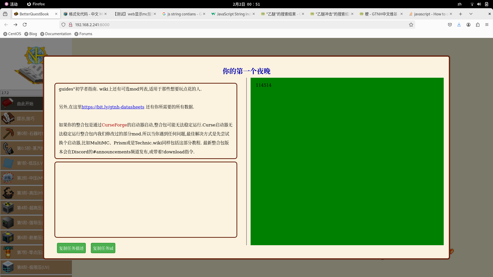

# Better_Online_QuestBook

## 2025/1/10

## *by MCTBL & Grievous_Rain*

### 更好的在线任务书!

一时间想不起是哪个任务但又不方便开游戏了?试试这个,更好的在线任务书!

### 使用方式

更目录下执行```npm i ```，然后```tsc```编译代码到bin目录，

自行在bin目录开启http服务器即可。（推荐使用anywhere）


### 更新说明

|版本|说明|
|---|---|
|0.0.1|先搭建个大概,整理下思路,有空再做,计划在4月份之前完工()|
|0.0.2|整理资源|
|0.0.3|一个简单的可运行版本|
|0.0.4|搜索复制初始化等核心功能均可用|
|0.0.5|添加菜单栏移动|
|1.0.0|实现基本的浏览|

### TODOList

以下任务排序不分先后

- [x] 1,实现侧栏以及iframe
- [x] 2,实现任务详情
- [x] 3,实现更好的工具链
- [x] 4,弄个图标吧
- [x] 5,弄个好看一点的logo吧
- [x] 6,实现搜索任务
- [x] 7,读取并且展示任务物品以及奖励列表
- [ ] 8,添加关于面板
- [ ] 9,优化假任务
- [ ] 10,优化任务数据里边多余的字符

---

now it looks like：



：）
